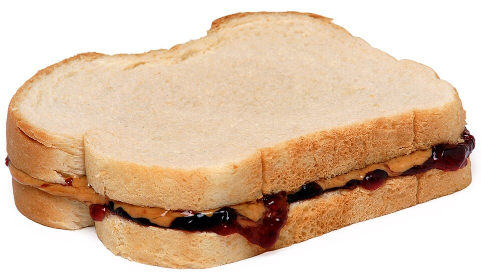

# How to make a PB&J sandwich

## Materials
  - Peanut butter
  - Jelly
  - Bread

## Process overview
  1. Spread PB on one piece of bread
  1. Spread jelly on other piece of bread
  1. Put the two pieces of bread together with the sticky sides in the middle

## Final result

## References

[Wikipedia - Peanut butter and jelly sandwich](https://en.wikipedia.org/wiki/Peanut_butter_and_jelly_sandwich)

